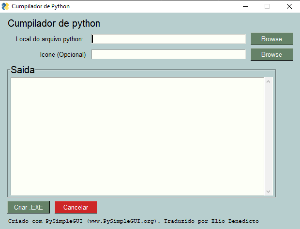

# Cumpilador de arquivos python

Transforme seu arquivo python em um executavel, sem dificuldades! Apenas execute o arquivo 'cumpilador.exe'
Se você quiser editar o programa, é só editar o arquivo codigo-fonte.py. Lembre-se de instalar a biblioteca; pysimplegui

